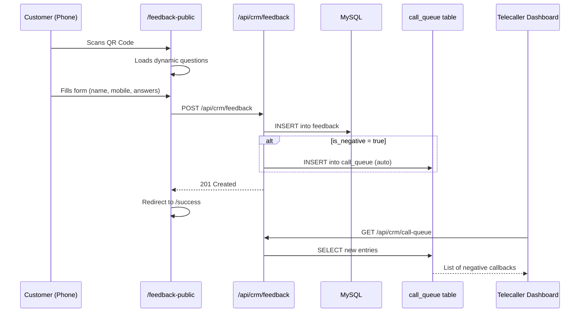
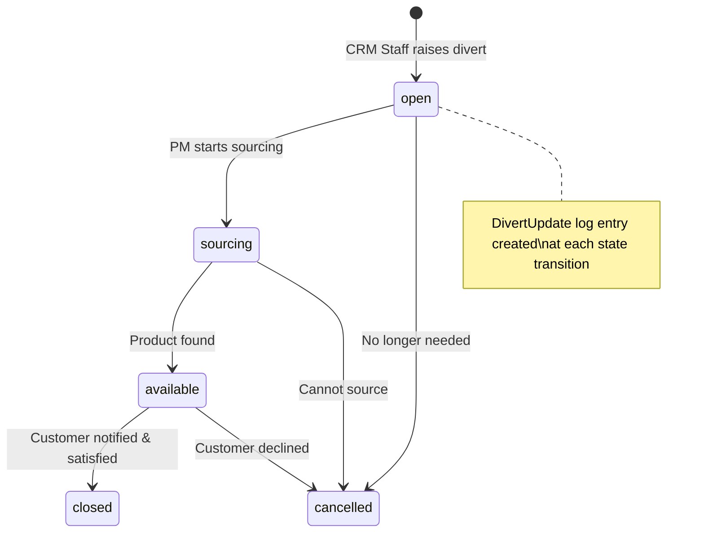

# 📋 BSC Retail CRM Hub — Complete Project Report

---

## 1. Executive Summary

**Project Name:** BSC Retail CRM Hub  
**Type:** Full-Stack Web Application (Internal Enterprise Tool)  
**Domain:** Retail Store Operations & Customer Relationship Management  
**Deployment:** `https://demoaradhyanextgenlabs.online`  
**Purpose:** A centralized, role-based operations hub for a retail store — managing footfall tracking, customer feedback, sourcing diverts, cash settlement, visual merchandising checklists, staff attendance, and live TV displays.

---

## 2. Technology Stack

### Frontend
| Layer | Technology | Version |
|---|---|---|
| Framework | React | 19.0 |
| Language | TypeScript | 5.9.x |
| Build Tool | Vite | 5.2.x |
| Styling | TailwindCSS | 3.4.x |
| UI Components | Radix UI (shadcn/ui) | Latest |
| Routing | React Router DOM | 6.23.x |
| HTTP Client | Axios | 1.6.x |
| Charts | Recharts | 2.12.x |
| Forms | React Hook Form + Zod | 7.51 / 3.23 |
| QR Code | qrcode.react | 3.1 |
| Icons | Lucide React | 0.378 |
| Notifications | Sonner | 1.4.x |
| Date Utils | date-fns | 4.4 |

### Backend
| Layer | Technology | Version |
|---|---|---|
| Runtime | Node.js | LTS |
| Framework | Express | 4.19.x |
| Language | TypeScript | 5.4.x |
| Database ORM | mysql2 (raw SQL + pool) | 3.9.x |
| Auth | JSON Web Tokens (jsonwebtoken) | 9.0.x |
| Password Hashing | bcryptjs | 2.4.x |
| Security | Helmet, CORS, express-rate-limit | Latest |
| Validation | express-validator | 7.0.x |
| Email | Nodemailer | 6.9.x |
| Logging | Morgan | 1.10.x |

### Database
| Layer | Technology |
|---|---|
| Engine | MySQL (hosted on Hostinger) |
| Connection | mysql2 connection pool (limit: 10) |
| Timezone | IST (UTC+5:30) — all date math is offset-corrected |

### Design Tokens
| Token | Value |
|---|---|
| Sidebar Color | Dark Navy `#1a2744` |
| Background | Warm Cream `#f5f0e8` |
| Typography | Inter / Outfit / JetBrains Mono |
| Theme | Dark sidebar + light main content area |

---

## 3. Full Directory Architecture

```
retail-crm-hub/
│
├── 📄 server.js               # Root Passenger entry (Hostinger deploy shim)
├── 📄 package.json            # Root scripts
├── 📄 .env                    # Root env
├── 📄 components.json         # shadcn/ui config
├── 📄 tsconfig.json           # Root TS config
│
├── 📁 backend/
│   ├── 📄 package.json        # Backend deps & scripts
│   ├── 📄 tsconfig.json
│   └── 📁 src/
│       ├── 📄 server.ts       # Express app bootstrap + middleware pipeline
│       ├── 📄 initDb.ts       # Database schema auto-creation (19 tables)
│       ├── 📄 seed.ts         # Default data seeding
│       │
│       ├── 📁 config/
│       │   └── 📄 db.ts       # MySQL pool + query/queryOne/transaction helpers
│       │
│       ├── 📁 middleware/
│       │   └── 📄 auth.ts     # JWT auth, role guards, PIN auth (TV/Cash/Greeter)
│       │
│       ├── 📁 lib/
│       │   ├── 📄 ist.ts      # IST timezone utilities (istNow, istToday, istHour)
│       │   └── 📄 email.ts    # Nodemailer wrapper for DER notifications
│       │
│       └── 📁 routes/
│           ├── 📄 auth.ts     # /api/auth — register, login, me, verify-pin
│           ├── 📄 crm.ts      # /api/crm — all core CRM operations (295 lines)
│           ├── 📄 cash.ts     # /api/cash — cash settlement CRUD
│           ├── 📄 vm.ts       # /api/vm — VM checklist points + submissions
│           └── 📄 attendance.ts # /api/attendance — attendance, roster, shifts
│
└── 📁 frontend/
    ├── 📄 index.html
    ├── 📄 vite.config.ts
    ├── 📄 tailwind.config.ts
    ├── 📄 postcss.config.js
    ├── 📄 package.json
    └── 📁 src/
        ├── 📄 main.tsx            # React DOM root mount
        ├── 📄 App.tsx             # Router + route definitions (14 routes)
        ├── 📄 index.css           # Global design system + Tailwind directives
        │
        ├── 📁 context/
        │   └── 📄 AuthContext.tsx # JWT session provider, login/logout, user state
        │
        ├── 📁 hooks/
        │   └── 📄 use-mobile.ts   # Responsive breakpoint hook
        │
        ├── 📁 lib/
        │   └── 📄 api.ts          # Axios instance (baseURL, auth header injection)
        │
        ├── 📁 layouts/
        │   └── 📄 AppLayout.tsx   # Shell layout: sidebar + topbar + <Outlet/>
        │
        ├── 📁 components/
        │   ├── 📄 ProtectedRoute.tsx  # Auth guard HOC (JWT + PIN modes)
        │   ├── 📁 crm/
        │   │   ├── 📄 CrmSidebar.tsx  # Navigation sidebar w/ role-filtered links
        │   │   ├── 📄 PinGate.tsx     # PIN entry overlay for TV/Cash/Greeter
        │   │   └── 📄 ui.tsx          # Shared CRM UI primitives
        │   └── 📁 ui/                 # 46 shadcn/ui components (button, card,
        │                              #  dialog, table, chart, badge, etc.)
        │
        └── 📁 pages/                  # 17 page components
            ├── 📄 Login.tsx
            ├── 📄 Onboarding.tsx
            ├── 📄 Dashboard.tsx
            ├── 📄 Footfall.tsx
            ├── 📄 FeedbackQR.tsx
            ├── 📄 FeedbackList.tsx
            ├── 📄 Feedback.tsx        # Public QR form (unauthenticated)
            ├── 📄 Divert.tsx
            ├── 📄 PMView.tsx
            ├── 📄 Reports.tsx
            ├── 📄 CashSettlement.tsx
            ├── 📄 VmChecklist.tsx
            ├── 📄 Attendance.tsx
            ├── 📄 Admin.tsx
            ├── 📄 TVDisplay.tsx
            ├── 📄 Greeter.tsx
            └── 📄 Success.tsx
```

---

## 4. System Architecture Diagram

```mermaid
graph TB
    subgraph CLIENT["🖥️ CLIENT LAYER (Browser)"]
        direction TB
        A1[React 19 SPA<br/>Vite + TypeScript]
        A2[React Router DOM v6<br/>14 protected routes]
        A3[AuthContext<br/>JWT localStorage]
        A4[Axios Instance<br/>Bearer Token injection]
    end

    subgraph SERVER["⚙️ SERVER LAYER (Node.js + Express)"]
        direction TB
        B1[Express Server<br/>Port 5000]
        B2[Helmet + CORS + Morgan<br/>Rate Limiter 200 req/15min]
        B3[JWT Middleware<br/>authenticateJWT]
        B4[Role Guard<br/>requireRole]
        subgraph ROUTES["API Routes"]
            R1[/api/auth]
            R2[/api/crm]
            R3[/api/cash]
            R4[/api/vm]
            R5[/api/attendance]
        end
    end

    subgraph DB["🗄️ DATABASE LAYER (MySQL)"]
        direction TB
        D1[(mysql2 Connection Pool<br/>Max 10 connections)]
        D2[19 Tables<br/>UUID primary keys]
    end

    subgraph EXTERNAL["📧 EXTERNAL SERVICES"]
        E1[SMTP / Nodemailer<br/>DER Email Alerts]
    end

    A1 --> A4
    A4 -->|HTTPS REST| B1
    B1 --> B2
    B2 --> B3
    B3 --> B4
    B4 --> R1
    B4 --> R2
    B4 --> R3
    B4 --> R4
    B4 --> R5
    R1 --> D1
    R2 --> D1
    R3 --> D1
    R4 --> D1
    R5 --> D1
    D1 --> D2
    R2 -->|DER trigger| E1
```

---

## 5. Database Schema (19 Tables)

```mermaid
erDiagram
    SETTINGS {
        int id PK
        varchar company_name
        varchar logo_url
        tinyint open_hour
        tinyint close_hour
        int footfall_grace_minutes
        int edit_cutoff_hours
        varchar der_email
        varchar tv_pin
        varchar cash_pin
        varchar greeter_pin
        tinyint setup_complete
    }

    USERS {
        uuid id PK
        varchar email
        varchar password_hash
        varchar full_name
        enum role
        tinyint is_active
    }

    SECTIONS {
        uuid id PK
        varchar name
        enum section_type
        varchar manager
        tinyint is_active
    }

    FOOTFALL_ENTRIES {
        uuid id PK
        date entry_date
        tinyint slot_hour
        int visitors
        varchar remarks
        varchar submitted_by
        timestamp created_at
    }

    DAILY_SUMMARIES {
        uuid id PK
        date entry_date
        int bills_count
    }

    FEEDBACK_QUESTIONS {
        uuid id PK
        text question
        json options
        int position
        tinyint is_active
    }

    FEEDBACK {
        uuid id PK
        date entry_date
        varchar customer_name
        varchar mobile
        date dob
        uuid section_id
        json answers
        text voice
        enum source
        tinyint is_negative
    }

    CALL_QUEUE {
        uuid id PK
        uuid feedback_id
        date entry_date
        varchar customer_name
        varchar mobile
        enum status
        text notes
        int attempts
        tinyint escalated
        date follow_up_date
    }

    DIVERT_REASONS {
        uuid id PK
        varchar code
        varchar label
        tinyint is_active
    }

    DIVERTS {
        uuid id PK
        int ref_no
        date entry_date
        uuid section_id
        text product_wanted
        int quantity
        varchar price_range
        varchar reason_code
        varchar customer_name
        varchar customer_mobile
        enum status
        text pm_notes
        uuid created_by
    }

    DIVERT_UPDATES {
        uuid id PK
        uuid divert_id FK
        enum status
        text note
        uuid actor_id
        varchar actor_role
        timestamp created_at
    }

    CASH_SETTLEMENTS {
        uuid id PK
        date entry_date
        decimal sale_amount
        int bills_count
        decimal cash_total
        decimal card_total
        decimal upi_total
        uuid submitted_by
    }

    CASH_COUNTER_REPORTS {
        uuid id PK
        uuid settlement_id FK
        varchar counter_name
        varchar cashier_name
        int bills_count
        decimal sale_amount
        decimal cash_amount
        decimal card_amount
        decimal upi_amount
        decimal staff_discount
        decimal customer_discount
    }

    VM_CHECKLIST_POINTS {
        uuid id PK
        varchar title
        text description
        varchar section
        int position
        tinyint is_active
    }

    VM_SUBMISSIONS {
        uuid id PK
        date entry_date
        enum shift
        varchar floor
        decimal score_percent
        uuid submitted_by
    }

    VM_SUBMISSION_ENTRIES {
        uuid id PK
        uuid submission_id FK
        uuid point_id
        varchar point_title
        enum score
        text remarks
        varchar photo_url
    }

    SHIFTS {
        uuid id PK
        varchar name
        time start_time
        time end_time
        tinyint is_active
    }

    ATTENDANCE_RECORDS {
        uuid id PK
        date entry_date
        uuid user_id FK
        uuid shift_id FK
        enum status
        datetime check_in
        datetime check_out
        int worked_minutes
        uuid marked_by
    }

    ROSTER_ENTRIES {
        uuid id PK
        date entry_date
        uuid user_id FK
        uuid shift_id FK
        text notes
        uuid created_by
    }

    FEEDBACK ||--o{ CALL_QUEUE : "triggers (if negative)"
    DIVERTS ||--o{ DIVERT_UPDATES : "has audit log"
    CASH_SETTLEMENTS ||--o{ CASH_COUNTER_REPORTS : "has counters"
    VM_SUBMISSIONS ||--o{ VM_SUBMISSION_ENTRIES : "has entries"
    USERS ||--o{ ATTENDANCE_RECORDS : "tracks"
    SHIFTS ||--o{ ATTENDANCE_RECORDS : "assigned to"
    SHIFTS ||--o{ ROSTER_ENTRIES : "planned in"
```



---

## 6. User Roles & Access Control

| Role | Access Scope |
|---|---|
| `super_admin` | All features + settings + user management |
| `admin` | All features (same as super_admin, no user creation limit) |
| `crm_manager` | Dashboard, Footfall, Feedback List, Diverts, Reports, Cash, VM Checklist |
| `crm_staff` | Dashboard, Footfall, Diverts, Cash Settlement |
| `telecaller` | Feedback List (call queue) only |
| `purchase_manager` | PM View (divert resolution) only |
| `vm` | VM Checklist only |
| `greeter` | Fullscreen Greeter Portal (PIN-based, no sidebar) |
| *(public)* | QR Feedback Form (completely unauthenticated) |

### Authentication Flows

```mermaid
flowchart TD
    A[User visits /] --> B{Setup Complete?}
    B -->|No| C[/onboard — First-run wizard]
    B -->|Yes| D{Has JWT in localStorage?}
    D -->|No| E[/login — Email + Password]
    D -->|Yes| F[GET /api/auth/me to verify token]
    F -->|Valid| G{Role?}
    F -->|Invalid| E
    G -->|greeter| H[/app/greeter — PIN Portal]
    G -->|tv| I[/app/tv — TV PIN Gate]
    G -->|others| J[/app — Main Dashboard]
    E --> K[POST /api/auth/login]
    K --> L[JWT stored 30 days]
    L --> G
```

---

## 7. Complete API Reference

### Auth — `/api/auth`
| Method | Endpoint | Auth | Description |
|---|---|---|---|
| `POST` | `/register` | Public | Create first super_admin (first-run only) |
| `POST` | `/login` | Public | Email + password → JWT |
| `GET` | `/me` | JWT | Get current user session |
| `GET` | `/setup-status` | Public | Check if onboarding is complete |
| `POST` | `/verify-pin` | Public | Verify TV/Cash/Greeter PIN |

### CRM — `/api/crm`
| Method | Endpoint | Auth | Description |
|---|---|---|---|
| `GET` | `/settings` | JWT | Fetch company settings |
| `PUT` | `/settings` | admin+ | Update settings |
| `POST` | `/settings/complete` | admin+ | Mark setup as complete |
| `GET` | `/sections` | JWT | List active sections |
| `POST` | `/sections` | admin | Create section |
| `DELETE` | `/sections/:id` | admin | Soft-delete section |
| `GET` | `/footfall` | JWT | Get footfall entries for date |
| `POST` | `/footfall/upsert` | JWT | Create or update hourly slot |
| `POST` | `/footfall/import` | crm_manager+ | Bulk import footfall rows |
| `GET` | `/daily-summaries` | JWT | Get daily bills count |
| `POST` | `/daily-summaries/upsert` | JWT | Save daily bills count |
| `GET` | `/feedback-questions` | JWT | List active feedback questions |
| `POST` | `/feedback-questions` | crm_manager+ | Add question |
| `DELETE` | `/feedback-questions/:id` | crm_manager+ | Remove question |
| `GET` | `/feedback` | JWT | List feedback (date/range filter) |
| `POST` | `/feedback` | JWT | Submit feedback (auto-creates call queue if negative) |
| `GET` | `/call-queue` | JWT | List call queue (date/status/section) |
| `PATCH` | `/call-queue/:id` | JWT | Update call status/notes/attempts |
| `GET` | `/divert-reasons` | JWT | List divert reason codes |
| `GET` | `/diverts` | JWT | List diverts (status filter) |
| `POST` | `/diverts` | JWT | Create divert + initial audit log |
| `PATCH` | `/diverts/:id` | JWT | Update divert + append audit log |
| `GET` | `/diverts/:id/updates` | JWT | Fetch full divert audit history |
| `GET` | `/users` | admin+ | List all users |
| `POST` | `/users` | admin+ | Create user |
| `PATCH` | `/users/:id` | admin+ | Update user (role, name, password, active) |
| `GET` | `/dashboard` | JWT | Today's KPIs (footfall, bills, diverts, feedback, hours) |
| `GET` | `/reports` | JWT | Date-range analytics (footfall, bills, feedback, diverts) |
| `POST` | `/verify-pin` | Public | PIN verification (TV/Cash/Greeter) |

### Cash — `/api/cash`
| Method | Endpoint | Auth | Description |
|---|---|---|---|
| `GET` | `/` | JWT | Fetch settlement + counters for date |
| `POST` | `/save` | JWT | Upsert settlement + replace counter reports |

### VM — `/api/vm`
| Method | Endpoint | Auth | Description |
|---|---|---|---|
| `GET` | `/points` | JWT | List active checklist points |
| `POST` | `/points` | crm_manager+ | Add checklist point |
| `DELETE` | `/points/:id` | crm_manager+ | Deactivate point |
| `GET` | `/submissions` | JWT | Last 30 VM submissions |
| `POST` | `/submit` | JWT | Submit checklist with all entries |

### Attendance — `/api/attendance`
| Method | Endpoint | Auth | Description |
|---|---|---|---|
| `GET` | `/` | JWT | Get people, shifts, attendance, roster for date |
| `POST` | `/upsert` | JWT | Create or update attendance record |
| `POST` | `/roster` | JWT | Assign/remove shift for roster entry |
| `GET` | `/shifts` | JWT | List active shifts |
| `POST` | `/shifts` | JWT | Create shift |
| `DELETE` | `/shifts/:id` | JWT | Soft-delete shift |

---

## 8. Frontend Routing Map

| Route | Component | Auth Mode | Role Restriction |
|---|---|---|---|
| `/` | Redirect → `/app` | — | — |
| `/onboard` | Onboarding | Public | — |
| `/login` | Login | Public | — |
| `/feedback-public` | Feedback | Public (QR) | — |
| `/success` | Success | Public | — |
| `/app/tv` | TVDisplay | PIN Gate (tv) | — |
| `/app/greeter` | Greeter | PIN Gate (greeter) | — |
| `/app` (index) | Dashboard | JWT | All roles |
| `/app/footfall` | Footfall | JWT | footfall page |
| `/app/feedback-qr` | FeedbackQR | JWT | feedbackQr |
| `/app/feedback-list` | FeedbackList | JWT | feedbackList |
| `/app/divert` | Divert | JWT | divert |
| `/app/pm-view` | PMView | JWT | pmView |
| `/app/reports` | Reports | JWT | reports |
| `/app/cash-settlement` | CashSettlement | JWT | cash (PIN) |
| `/app/vm-checklist` | VmChecklist | JWT | vmChecklist |
| `/app/attendance` | Attendance | JWT | attendance |
| `/app/admin` | Admin | JWT | admin only |

---

## 9. Feature Inventory

### Feature 1 — Dashboard (`/app`)
- 5 KPI Cards: Today Footfall · Total Bills · Open Diverts · NPS% · CSI%
- Summary Ribbon: Total Logged · Peak Hour · Peak Count · Conversion Rate
- SVG Area Chart: Hourly footfall distribution with area fill
- Hourly Audit Table: 12 slots (10 AM–10 PM), color-coded status badges
- Voice-of-Customer Ticker: Scrolling marquee of today's feedback
- **Auto-refreshes every 30 seconds**

### Feature 2 — Footfall Entry (`/app/footfall`)
- 12 hourly slot entry cards (10 AM–10 PM)
- Slot locking: cannot submit future slots
- Past slot editable within configurable grace period
- Per-slot visitor count + remarks with submitted-by attribution
- Daily Bills count separate field
- Edit cutoff enforcement from Settings

### Feature 3 — Feedback QR Display (`/app/feedback-qr`)
- Generates QR code linking to public feedback URL
- Tablet-ready display for customer scanning at POS

### Feature 4 — Public Customer Feedback Form (`/feedback-public`)
- **Fully unauthenticated** — accessible by any customer
- Dynamic questions from `feedback_questions` table
- Captures: Name, Mobile, DOB, Section, up to 8 Q&As, free-text voice
- **Auto-creates call queue entry if feedback is negative** (q1 = No/Maybe)
- Source tagged as `qr`

### Feature 5 — Feedback List / Call Queue (`/app/feedback-list`)
- Telecaller/CRM Manager view of all negative-feedback call-backs
- Filter: Date · Status · Section · Call Type
- Status lifecycle: `new → called → resolved / escalated`
- Log call notes, attempt count, escalation flag, follow-up date
- Color-coded status pills

### Feature 6 — Sourcing Diverts (`/app/divert`)
- Create diverts: Section · Product · Qty · Price Range · Fabric/Occasion · Reason · Customer info · Delivery date
- Status workflow: `open → sourcing → available → closed / cancelled`
- PM Action column for Purchase Manager status updates + notes
- **Full audit trail** (DivertUpdates: timestamped, role-attributed)
- DER (Divert Exception Report) email notifications
- Badge counter in sidebar showing open diverts

### Feature 7 — Purchase Manager View (`/app/pm-view`)
- Read-only + action view for purchase_manager role
- Shows all open/sourcing diverts
- Inline status update + sourcing notes

### Feature 8 — Reports & Analytics (`/app/reports`)
- Date-range report with: Footfall trends · Feedback summary · Divert resolution rates
- Extensible chart-ready data structure

### Feature 9 — Cash Settlement (`/app/cash-settlement`)
- **PIN-protected** (separate from JWT login)
- Entry: Sale Amount · Bills Count · Cash/Card/UPI totals
- Per-counter breakdown: Cashier name, amounts, staff discount, customer discount
- Auto-calculates ABV (Average Bill Value)
- Stores CashSettlement header + CashCounterReport rows

### Feature 10 — VM Checklist (`/app/vm-checklist`)
- Dynamic checklist points from admin-configured `vm_checklist_points`
- Submission types: Opening / Mid-Day / Closing per floor
- Each point: Pass / Fail / NA + remarks + photo URL
- Auto-calculated score percentage per submission
- Admin view of submission history

### Feature 11 — Admin Panel (`/app/admin`)
- **Company Settings:** Name, Logo URL, Operating hours, Grace period, Edit cutoff, DER email
- **User Management:** Create/view/edit/reset-password/deactivate users
- **Section Management:** Create/delete store sections with type & manager
- **Feedback Question Management:** Dynamic Q&A question editor

### Feature 12 — Live TV Display (`/app/tv`)
- **Fullscreen mode** for store display screens
- Shows live: Footfall · NPS · CSI · Open Diverts
- Auto-refreshes every minute
- Customer review marquee ticker
- **TV PIN authentication** (separate from JWT)

### Feature 13 — Greeter Portal (`/app/greeter`)
- **Fullscreen tablet interface** for store greeters
- PIN-based identification
- Real-time customer entry logging
- Touch-friendly, no sidebar

### Feature 14 — Authentication & Onboarding
- **First-Run Onboarding:** Wizard to set up company + first admin (only if `setup_complete = false`)
- JWT login with 30-day expiry
- Role-based redirect post-login
- ProtectedRoute HOC for all secure pages
- Token stored in localStorage, verified on app load

---

## 10. Security Architecture

| Concern | Implementation |
|---|---|
| Authentication | JWT Bearer tokens (30-day expiry) |
| Password storage | bcrypt (12 rounds) |
| Role authorization | `requireRole()` middleware — super_admin/admin bypass |
| Special area access | Separate PIN authentication for TV, Cash, Greeter |
| Rate limiting | 200 req / 15 min per IP on all `/api` routes |
| HTTP headers | Helmet.js (all headers, CSP disabled for SPA) |
| CORS | Whitelist: localhost:5173 + aradhyanextgenlabs.space |
| Input validation | express-validator on auth routes |
| SQL injection | Parameterized queries via mysql2 prepared statements |
| Public endpoints | `/feedback-public`, `/api/auth/setup-status`, `/api/crm/verify-pin` — explicitly unauthenticated |

---

## 11. Key Architectural Decisions

| Decision | Rationale |
|---|---|
| **Single-server deployment** | Express serves both API (`/api/*`) and frontend static files (`frontend/dist`). One Hostinger Passenger node handles both. |
| **Raw SQL over ORM** | `mysql2` with helper functions (`query`, `queryOne`, `transaction`). Simpler, lower overhead, full control for this single-DB application. |
| **IST timezone enforcement** | All dates computed with `+5:30` offset in both backend (`ist.ts`) and frontend to avoid MySQL UTC midnight bugs. |
| **UUID primary keys** | All tables use UUID strings instead of auto-increment IDs for distributed safety and no sequential guessing. |
| **Upsert pattern** | Critical daily entries (footfall slots, cash settlements, daily summaries) use `ON DUPLICATE KEY UPDATE` for idempotent saves. |
| **Auto-migration** | `initDb.ts` runs `CREATE TABLE IF NOT EXISTS` on every startup — safe for production upgrades without manual migrations. |
| **PIN gates vs JWT** | TV display, Cash settlement, and Greeter need access by non-IT staff, so PIN-based access is used without full user accounts. |
| **Public QR form** | `/feedback-public` is intentionally unauthenticated — customers scan QR and submit directly, no session required. |
| **Role seeding** | First user registered always becomes `super_admin`; subsequent `/register` calls create `crm_staff`. |
| **Auto call queue** | Negative feedback automatically creates a `call_queue` entry — no manual step required. |

---

## 12. Data Flow Diagrams

### Customer Feedback Flow


### Divert Workflow


---

## 13. Deployment Architecture

```
Internet
    │
    ▼
Hostinger VPS
    │
    ├── Passenger (Node.js) — server.js (entry shim)
    │       │
    │       └── Express (backend/src/server.ts)
    │               ├── Serves /api/* routes
    │               └── Serves frontend/dist/* (static SPA)
    │
    └── MySQL Database (localhost:3306)
            └── u510366842_retail_crm
```

**Domain:** `aradhyanextgenlabs.space`  
**Proxy:** Hostinger Passenger with `trust proxy 1` enabled  
**Static Serving:** Express serves the Vite build output directly — no separate nginx needed

---

## 14. What's Fully Implemented vs. Enhancement Areas

### ✅ Fully Working
- JWT authentication + role-based access control
- Dashboard with live KPI cards + footfall chart + feedback ticker
- Hourly footfall entry with slot locking + grace period
- Public QR customer feedback form with dynamic questions
- Call queue / telecaller follow-up workflow
- Sourcing divert management with full audit trail
- Cash settlement with per-counter breakdown + auto-calculated ABV
- VM checklist scoring system (Opening/Mid-Day/Closing)
- Staff attendance tracking with shift + roster management
- Admin panel (users, sections, feedback questions, settings)
- TV Display fullscreen (PIN-protected)
- Greeter Portal fullscreen (PIN-protected)
- First-run onboarding wizard

### 🔧 Enhancement Opportunities
| Feature | Status | Notes |
|---|---|---|
| Reports charts | Basic | Add date-range trend charts, CSV/PDF export |
| Push notifications | Missing | Real-time alerts for new diverts / negative feedback |
| SMS/WhatsApp | Partial | DER email exists; WhatsApp note is manual text |
| Dark mode toggle | Not built | CSS vars are ready; needs a theme switch |
| Mobile responsiveness | Partial | Sidebar collapses; some tables may overflow |
| Greeter → Footfall sync | Manual | Greeter logs not yet auto-synced to footfall entries |
| Feedback captcha | Missing | Public form has no bot protection |
| Audit log for admin actions | Missing | No logging of admin changes (user edits, settings) |

---

## 15. File Count Summary

| Area | Files | Size Estimate |
|---|---|---|
| Backend source | 12 TS files | ~45 KB |
| Frontend pages | 17 TSX files | ~120 KB |
| Frontend components | 49 TSX files | ~135 KB |
| Frontend context/hooks/lib | 4 files | ~10 KB |
| **Total source files** | **~82** | **~310 KB** |
| Database tables | 19 | — |
| API endpoints | 40+ | — |

---

*Report generated: July 30, 2026 | Project: BSC Retail CRM Hub | Version: 1.0.0*
